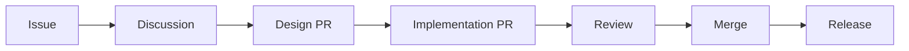

# PM-AI Design System

## Vision

PM-AI is an **AI-native developer workflow tool** that lives in your codebase. It bridges the gap between AI assistants and human developers, making project management seamless, intelligent, and developer-first.

> **Your AI project manager, living in your codebase**

---

## Positioning Statement

**For:** Developers who want AI-assisted project management without leaving their workflow

**Unlike:** Traditional PM tools (Jira, Linear, Asana) that are web-first and AI-retrofitted

**PM-AI provides:** AI-native project management that integrates with your development environment through CLI, MCP, and beautiful web interfaces

---

## Core Philosophy

### 1. Developer-First
Everything starts from the developer workflow:
- Terminal-native (CLI)
- Git-aware (branch-based projects)
- Editor-integrated (VS Code extension)
- Markdown-based plans (version controlled)

### 2. AI-Native
Built from the ground up for AI collaboration:
- MCP protocol for seamless AI integration
- Natural language interface
- AI-readable project state
- Intelligent task breakdown and dependency analysis

### 3. Workflow, Not Tool
PM-AI is how you work, not another tool to manage:
- Folder-based projects (lives in your code)
- Markdown plans (lives in git)
- Automatic context (git branch detection)
- Invisible when not needed

### 4. Open & Extensible
Community-driven development:
- Open source (MIT license)
- Plugin system for integrations
- Template library for common patterns
- Community contribution guidelines

---

## Target Users

### Primary: Solo Developers & Small Teams
- Want AI assistance but don't need enterprise complexity
- Value workflow integration over feature bloat
- Prefer terminal/editor over web dashboards
- Need simple, intelligent project management

### Secondary: Open Source Maintainers
- Manage multiple projects across repos
- Need community contribution tracking
- Want AI help with issue triage and planning
- Value transparency and extensibility

### Future: Development Teams
- Teams adopting AI workflows
- Need collaboration features
- Want AI-powered project insights
- Require integration with existing tools

---

## Core Use Cases

### 1. Feature Development Workflow
```bash
# Start new feature
pm-ai init feature/user-auth

# Plan with AI assistance
pm-ai plan create "Implement OAuth2 with Google and GitHub"

# Work through tasks
pm-ai task start      # Start next task on critical path
pm-ai task done       # Mark complete, auto-advance

# Review progress
pm-ai status          # Show progress, blockers, next steps
```

### 2. Git-Integrated Project Management
```bash
# Context-aware based on git branch
git checkout feature/payment
pm-ai status
# → Automatically loads "payment" feature tasks

# Create branch from task
pm-ai task branch
# → Creates feature/task-name branch, links to task
```

### 3. AI-Assisted Planning
```markdown
# User provides high-level description in markdown

## Payment System
Need to accept payments via Stripe and PayPal.
Subscriptions, one-time payments, refunds.
Webhooks for payment events.

# PM-AI (via Claude) breaks down into:
- Setup Stripe API integration
- Implement payment flow
- Add webhook handlers
- Create subscription management
- Build refund process
- Add payment history view
# → With dependencies, priorities, time estimates
```

### 4. Continuous Project Tracking
```bash
# Quick status checks
pm-ai status          # Overall progress
pm-ai blockers        # What's blocking progress
pm-ai next            # What should I work on?
pm-ai critical-path   # Bottleneck analysis

# Open dashboard for visual view
pm-ai open
```

---

## Architecture Principles

### 1. Modular & Monorepo
```
pm-ai/
├── packages/
│   ├── core/         # Domain logic, database, types
│   └── utils/        # Shared utilities
├── apps/
│   ├── cli/          # Command-line interface
│   ├── mcp/          # MCP server (AI integration)
│   ├── api/          # REST API (optional)
│   └── web/          # Web dashboard (optional)
└── plugins/          # Community integrations
```

**Benefits:**
- Clear separation of concerns
- Independent deployment (CLI standalone, MCP optional)
- Easy extension (plugins)
- Type-safe sharing (TypeScript)

### 2. Database: SQLite (libSQL)
- **Location:** `~/.config/pm-ai/db.sqlite`
- **Why:** Zero native dependencies, simple backup, portable
- **ORM:** Drizzle (type-safe, great DX)
- **Migrations:** Automatic on startup

### 3. Multi-Interface Strategy
All interfaces use the same core:

```
┌─────────────┐     ┌─────────────┐     ┌─────────────┐
│     CLI     │     │     MCP     │     │     Web     │
│  (Terminal) │     │  (Claude)   │     │  (Dashboard)│
└──────┬──────┘     └──────┬──────┘     └──────┬──────┘
       │                   │                   │
       └───────────────────┼───────────────────┘
                           ▼
                    ┌─────────────┐
                    │    Core     │
                    │  (Package)  │
                    └─────────────┘
                           │
                           ▼
                    ┌─────────────┐
                    │  Database   │
                    │  (SQLite)   │
                    └─────────────┘
```

### 4. Folder-Based Projects
```
my-project/
├── .pm-ai              # Project config (auto-generated)
├── src/                # Your code
├── plans/              # Markdown plans (optional)
│   ├── auth.md
│   └── payments.md
└── package.json
```

**Benefits:**
- Projects live with code
- Git-friendly (plans versioned)
- Context-aware (auto-detect current project)
- Portable (works with any repo)

---

## Feature Roadmap

### Phase 1: Foundation (Current)
**Status:** ✅ Implemented
- ✅ MCP server with full CRUD
- ✅ Folder-based projects
- ✅ Markdown plan sync
- ✅ Dependency graph analysis
- ✅ Web dashboard
- ✅ Task management with priorities

**Immediate priorities:**
- [ ] CLI tool (`npm install -g pm-ai`)
- [ ] Git branch detection
- [ ] Improved onboarding flow
- [ ] CLI-based task management

### Phase 2: Developer Experience (3 months)
**Goal:** Make PM-AI invisible in daily workflow

**Features:**
- [ ] Git integration (branch-based project switching)
- [ ] VS Code extension (sidebar, status bar, commands)
- [ ] Task-time tracking (automatic)
- [ ] Smart task suggestions (AI)
- [ ] Template library (common feature patterns)
- [ ] Improved error messages and onboarding

**Developer experience:**
```bash
# Seamless workflow
pm-ai init                    # One-time setup
pm-ai task start              # Start working
# ... code ...
pm-ai task done               # Mark complete
pm-ai task start              # Auto-advance to next
```

### Phase 3: Ecosystem (6 months)
**Goal:** Community-driven integrations

**Features:**
- [ ] Plugin system (stable API)
- [ ] GitHub Issues sync
- [ ] GitLab integration
- [ ] Jira import/export
- [ ] Notion sync
- [ ] Slack/Discord notifications
- [ ] Calendar integration

**Plugin architecture:**
```typescript
// Example plugin
interface PMPlugin {
  name: string
  version: string

  // Hooks
  onTaskCreate?(task: Task): Promise<void>
  onTaskUpdate?(task: Task): Promise<void>
  onProjectInit?(project: Project): Promise<void>

  // Commands
  commands?: Command[]
}

// Community plugin: GitHub sync
export const githubSyncPlugin: PMPlugin = {
  name: 'github-sync',
  version: '1.0.0',

  onTaskCreate: async (task) => {
    // Create GitHub issue
    await createIssue(task)
  }
}
```

### Phase 4: AI Enhancement (9 months)
**Goal:** AI as active collaborator, not just assistant

**Features:**
- [ ] Predictive task estimation
- [ ] Automatic dependency detection
- [ ] Code review → task conversion
- [ ] Blocker prediction and prevention
- [ ] Progress forecasting
- [ ] Natural language project queries
- [ ] AI-powered task prioritization

**Example:**
```
User: "What's blocking the payment feature?"
PM-AI: "The Stripe API integration task is blocking 3 downstream tasks:
       - Implement payment flow
       - Add webhook handlers
       - Create subscription management

       Estimated delay: 2-3 days
       Suggested action: Split Stripe integration into smaller chunks"
```

### Phase 5: Collaboration (12 months)
**Goal:** Support team workflows while staying developer-first

**Features:**
- [ ] Multi-user support
- [ ] Task assignments
- [ ] Comments and discussions
- [ ] Activity feed
- [ ] Role-based permissions
- [ ] Team analytics

**Note:** Collaboration features are opt-in. Solo workflow remains primary.

---

## Design Patterns

### 1. Project Structure
```
workspace/
├── .pm-ai                    # Workspace config
├── packages/
│   ├── auth/                # Feature: Authentication
│   │   ├── .pm-ai           # Feature config
│   │   └── src/
│   └── payments/            # Feature: Payments
│       ├── .pm-ai           # Feature config
│       └── src/
```

### 2. Task Data Model
```typescript
interface Task {
  id: string
  title: string
  description?: string
  status: 'planned' | 'in-progress' | 'review' | 'done'
  priority: 'high' | 'medium' | 'low'
  dependencies: string[]  // Task IDs

  // Metadata
  createdAt: Date
  updatedAt: Date
  completedAt?: Date
  estimate?: number  // hours

  // AI-generated
  suggestions?: string[]
  blockers?: string[]
  relatedTasks?: string[]

  // Git integration
  branch?: string
  commits?: string[]
  prs?: string[]
}
```

### 3. Plan Structure
```markdown
# Feature: User Authentication

## Overview
Implement OAuth2 authentication with Google and GitHub providers.

## Tasks
- [ ] Setup OAuth2 providers (high priority)
- [ ] Implement JWT token generation (high priority)
  - Depends on: Setup OAuth2 providers
- [ ] Create login UI (medium priority)
  - Depends on: Setup OAuth2 providers
- [ ] Add password reset flow (medium priority)
  - Depends on: Implement JWT token generation
- [ ] Write integration tests (low priority)
  - Depends on: Create login UI

## Notes
- Use NextAuth.js for OAuth
- JWT secrets in environment variables
- Rate limiting on auth endpoints
```

### 4. Dependency Visualization
```
┌─────────────────────────────────────────┐
│           Authentication Feature        │
│                                         │
│  [OAuth Setup]                          │
│       ├─→ [JWT Tokens]                  │
│       │      ├─→ [Login UI]             │
│       │      │      └─→ [Tests]         │
│       │      └─→ [Password Reset]      │
│       └─→ [User Model]                  │
└─────────────────────────────────────────┘

Critical path: OAuth Setup → JWT Tokens → Password Reset
Estimated: 3-5 days
```

---

## Technology Stack

### Current
```yaml
Runtime: Node.js 18+
Language: TypeScript
Package Manager: pnpm
Build Tool: Turborepo

Database:
  Type: SQLite
  Client: libSQL (no native deps)
  ORM: Drizzle

API:
  Framework: Hono (for REST API, optional)
  Protocol: MCP (for AI integration)

CLI:
  Framework: Commander.js or CAC (TBD)
  UI: Ink oroclity (TBD)

Web:
  Framework: React
  Build: Vite
  Routing: React Router
  State: TanStack Query
  UI: Shadcn/ui (considering)

MCP:
  SDK: @modelcontextprotocol/sdk
```

### Considerations
- **Bun:** May switch for faster startup (CLI)
- **Better SQLite:** Current libSQL has limitations
- **Tauri:** For desktop app (future)

---

## Performance & Scalability

### Current Capabilities
- **Projects:** 1000+ per database
- **Tasks:** 10,000+ per project
- **Concurrent users:** Single-user (currently)

### Optimization Targets
1. **Database indexing** on frequently queried fields
2. **Lazy loading** for large task lists
3. **Caching** for dependency graphs
4. **Query optimization** for complex filters

### Future Scaling
- **Multi-tenancy:** Separate databases per workspace
- **Sync:** Optional cloud sync for teams
- **Caching:** Redis for distributed setups
- **Pagination:** For large datasets

---

## Security & Privacy

### Principles
1. **Local-first:** Data stays on user machine by default
2. **No telemetry:** Without explicit opt-in
3. **Minimal permissions:** Only necessary file access
4. **Transparent:** Open source, auditable code

### Data Handling
```yaml
Storage:
  Location: ~/.config/pm-ai/db.sqlite
  Backup: User-controlled (cp db.sqlite backup.db)
  Sync: Optional, encrypted (future)

Permissions:
  Files: Read project files (plans, source)
  Network: Only for sync (opt-in)
  Git: Read branch info (optional)

Encryption:
  At rest: Optional (user-provided key)
  In transit: TLS (for sync)
```

### Security Checklist
- [ ] Input sanitization (CLI arguments)
- [ ] SQL injection prevention (Drizzle handles)
- [ ] Path traversal protection
- [ ] Dependency security audits
- [ ] Secret scanning (CI/CD)

---

## Testing Strategy

### Unit Tests
```typescript
// Core business logic
describe('dependencyGraphService', () => {
  it('should detect circular dependencies', () => {
    const tasks = createTaskChain(['A→B→C→A'])
    const result = detectCircularDependencies(tasks)
    expect(result.hasCycle).toBe(true)
  })

  it('should find critical path', () => {
    const tasks = createComplexTaskGraph()
    const path = getCriticalPath(tasks)
    expect(path.length).toBeGreaterThan(0)
  })
})
```

### Integration Tests
```typescript
// CLI workflow
describe('CLI: pm-ai init', () => {
  it('should create .pm-ai config', async () => {
    await exec('pm-ai init test-project')
    await expectFile('.pm-ai')
    await expectInFile('.pm-ai', /test-project/)
  })
})
```

### E2E Tests
```typescript
// MCP server integration
describe('MCP: init_project', () => {
  it('should create project and return ID', async () => {
    const result = await mcpClient.callTool('init_project', {
      name: 'test-project'
    })
    expect(result.project_id).toBeDefined()
  })
})
```

---

## Documentation Strategy

### Audience: Developers
- **Quick Start:** 5-minute walkthrough
- **CLI Reference:** Complete command documentation
- **MCP Guide:** How to use with Claude
- **API Reference:** For plugin developers
- **Contributing:** For community contributors

### Content Types
```markdown
# docs/
├── quick-start.md         # Get started in 5 mins
├── cli/                   # CLI documentation
│   ├── commands.md
│   ├── config.md
│   └── workflow.md
├── mcp/                   # MCP server docs
│   ├── setup.md
│   ├── tools.md
│   └── prompts.md
├── plugins/               # Plugin development
│   ├── getting-started.md
│   ├── api-reference.md
│   └── examples.md
└── contributing/          # Community guide
    ├── roadmap.md
    ├── good-issues.md
    └── pull-requests.md
```

### Examples
- **Video tutorials:** Screen recordings of workflows
- **Template library:** Common feature patterns
- **Integration guides:** GitHub, GitLab, VS Code
- **Case studies:** Real-world usage examples

---

## Community & Governance

### Open Source Principles
1. **Transparent:** Public roadmap, issue tracking
2. **Inclusive:** Welcoming to all contributors
3. **Meritocratic:** PRs judged on quality
4. **Sustainable:** Maintainable codebase

### Contribution Workflow


### Community Platforms
- **GitHub:** Issues, PRs, Discussions
- **Discord:** Real-time chat (future)
- **Discourse:** In-depth discussions (future)
- **YouTube:** Tutorials and demos (future)

### Recognition
- **Contributors.md:** List all contributors
- **Release notes:** Credit contributors
- **Shoutouts:** Blog posts for major contributions
- **Swag:** Stickers, shirts for top contributors (future)

---

## Metrics & Success

### Adoption Metrics
- **npm installs:** Weekly downloads
- **GitHub stars:** Community interest
- **Active users:** MCP server + CLI
- **Contributors:** Community engagement

### Quality Metrics
- **Test coverage:** >80%
- **Issue response time:** <48 hours
- **PR review time:** <1 week
- **Bug rate:** <5% of issues

### Developer Satisfaction
- **Survey results:** Annual user survey
- **Retention:** Return users
- **Feature requests:** Community input
- **Plugins:** Community extensions

---

## Brand & Visual Identity

### Logo Concept
```
   ╭─────────╮
   │  ◉ ◉ ◉  │   ← Three dots (tasks/dots/progress)
   │   PM-AI │
   ╰─────────╯
```

**Colors:**
- Primary: `#6366f1` (Indigo - AI/tech)
- Secondary: `#10b981` (Emerald - progress/success)
- Accent: `#f59e0b` (Amber - warnings/attention)

**Typography:**
- Headings: Inter (modern, readable)
- Code: JetBrains Mono (developer-friendly)
- Body: System fonts (native feel)

### Voice & Tone
- **Direct:** No fluff, get to the point
- **Developer-focused:** Use technical terms correctly
- **Helpful:** Assume intelligence, explain complexity
- **Efficient:** Short docs, long examples

---

## Competitive Analysis

### Direct Competitors
| Tool | AI | CLI | Git | Open Source |
|------|-----|-----|-----|-------------|
| **PM-AI** | ✅ Native | ✅ | ✅ Planned | ✅ |
| Linear | ⚠️ Basic | ❌ | ❌ | ❌ |
| GitHub Projects | ⚠️ Copilot | ❌ | ✅ | ✅ Partial |
| Jira | ⚠️ Basic | ❌ | ⚠️ | ❌ |

### Indirect Competitors
- **Notion:** Knowledge base + tasks (no AI workflow)
- **Trello:** Simple kanban (no AI, no CLI)
- **Asana:** Project management (no dev workflow)
- **Obsidian:** Knowledge base (no task management)

### Differentiation
**PM-AI = AI + CLI + Git + Open Source**
- Only AI-native PM tool
- Only one with first-class CLI
- Only one that lives in your codebase
- Only fully open source option

---

## Risks & Mitigations

### Technical Risks
| Risk | Impact | Mitigation |
|------|--------|------------|
| MCP protocol changes | High | Stay updated, abstraction layer |
| SQLite limitations | Medium | Plan migration path, optimize queries |
| Dependency updates | Low | Regular audits, Dependabot |

### Market Risks
| Risk | Impact | Mitigation |
|------|--------|------------|
| Competitor adds AI | High | Faster iteration, community moat |
| Low adoption | Medium | Better onboarding, examples |
| Contributor burnout | Low | Sustainable pace, clear roadmap |

### Mitigation Strategies
1. **Protocol abstraction:** Wrap MCP SDK for easy swapping
2. **Database abstraction:** Support Postgres in future
3. **Community building:** Early adopters become maintainers
4. **Documentation:** Reduce support burden with great docs

---

## Future Vision

### 5-Year Vision
> PM-AI is the standard for AI-native project management in open source development.

**Indicators of success:**
- 10,000+ GitHub stars
- 1,000+ npm weekly downloads
- 100+ community plugins
- Integrated with major AI assistants (Claude, Copilot, etc.)

### Moonshot Ideas
- **AI project manager:** Fully autonomous project management
- **Cross-repo dependency tracking:** Monorepo-aware
- **Predictive analytics:** Forecast completion dates
- **Natural language programming:** Describe feature, get code
- **Community marketplace:** Share/sell plugins and templates

---

## Decision Log

### 2025-03-12: Open Source Strategy
**Decision:** MIT license, community-driven development
**Rationale:** Maximize adoption, encourage contributions
**Trade-off:** No commercial exclusivity

### 2025-03-12: MCP-First Architecture
**Decision:** Build MCP server as primary interface
**Rationale:** AI-native future, Claude integration
**Trade-off:** Dependency on Anthropic ecosystem

### 2025-03-12: SQLite Database
**Decision:** Use SQLite with libSQL client
**Rationale:** Zero setup, portable, no native deps
**Trade-off:** Limited concurrency (acceptable for solo users)

### 2025-03-12: Monorepo Structure
**Decision:** Turborepo with packages/apps structure
**Rationale:** Code sharing, independent deployments
**Trade-off:** Build complexity

---

## Appendix

### Glossary
- **MCP:** Model Context Protocol - AI assistant integration
- **Workspace:** Root folder containing multiple projects
- **Feature:** A project or domain area (e.g., "Authentication")
- **Plan:** Markdown document with structured tasks
- **Task:** Individual work item with dependencies
- **Critical Path:** Longest dependency chain (bottleneck)

### Related Projects
- **Model Context Protocol:** https://modelcontextprotocol.io
- **Drizzle ORM:** https://orm.drizzle.team
- **Hono:** https://hono.dev
- **Turborepo:** https://turbo.build/repo

### References
- **The CLI Design Guidelines:** https://clig.dev
- **Engineering Design Docs:** Google's template
- **The Art of CLI Design:** Various blog posts

---

**Last Updated:** 2025-03-12
**Version:** 1.0.0
**Status:** Living Document
